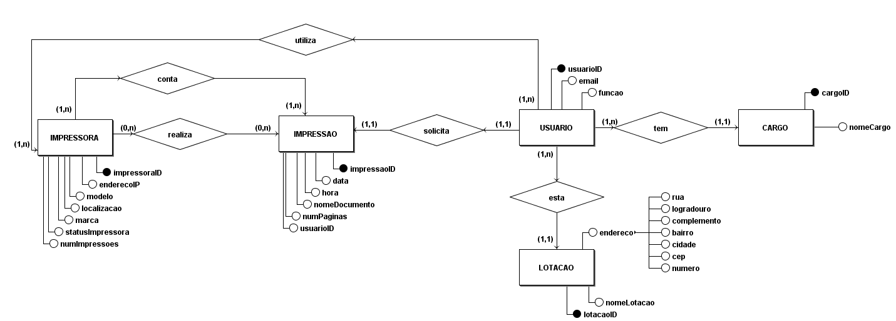
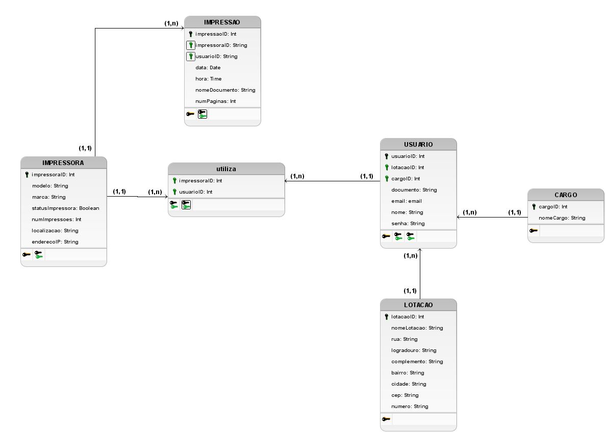

## Modelo Entidade-Relacionamento (ME-R)
### 1) Entidades
• IMPRESSORA

• USUARIO

• IMPRESSAO
### 2) Descrição das Entidades
- IMPRESSORA (impressoraID, enderecoIP, modelo, localizacao, marca,
statusImpressora, numImpressoes)
- USUARIO (usuarioID, email, funcao)
- IMPRESSAO (impressaoID, impressoraID, data, hora, nomeDocumento,
numPaginas, usuarioID)
### 3) Relacionamentos:

IMPRESSORA – realiza – IMPRESSAO

Cada impressora tem a capacidade de realizar impressões, permitindo que
documentos sejam impressos por ela. Cada impressão será realizada por uma
impressora.
1-> N

USUARIO – utiliza – IMPRESSORA

Cada usuário tem a capacidade de utilizar uma ou mais impressoras para
realizar tarefas de impressão, permitindo a associação entre um usuário e as
impressoras que eles usam.
N -> M

USUARIO – solicita – IMPRESSAO

Cada registro de contagem de impressões é associado a um usuário que
iniciou a tarefa de impressão, possibilitando a identificação do usuário
responsável.
1->N

IMPRESSORA – conta – IMPRESSAO

Cada registro de contagem de impressões está vinculado a uma impressora,
permitindo rastrear as estatísticas de impressão para cada dispositivo.
1->N

### Diagrama Entidade-Relacionamento (DE-R)

### Diagrama Lógico de Dados (DLD)

