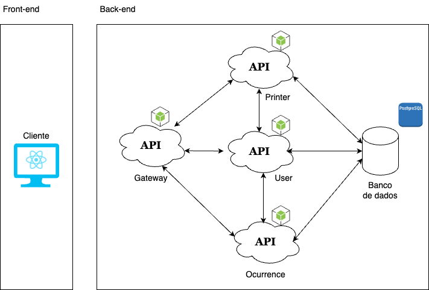
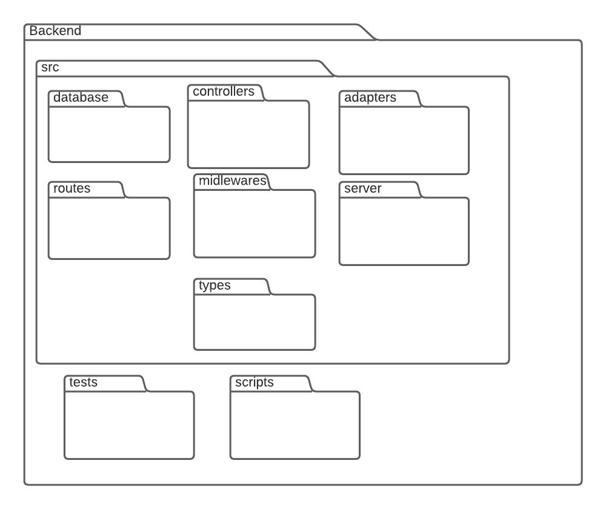

# Documento de Arquitetura

## 1. Introdução
Este documento tem como principal objetivo fornecer uma visão abrangente e estruturada da arquitetura do sistema. Ele descreve as principais decisões de design, componentes, módulos, interações e estrutura do software.

## 1.1. Visão Geral
Este documento está estruturado da seguinte forma:
- Introdução
- Representação arquitetural
- Visão Lógica
- Referências bibliográficas
- Histórico de versão

## 2. Representação Arquitetural

### 2.1. Diagrama de Relações

O paradigma arquitetônico dos microsserviços compreende uma abordagem na qual uma aplicação é estruturada a partir de componentes menores, implementados de maneira independente para assegurar um acoplamento flexível. Esses serviços autônomos, geralmente, se comunicam por meio de APIs e são organizados conforme as regras de negócios.

A adoção da arquitetura de microsserviços não só acelera o ciclo de desenvolvimento, mas também simplifica significativamente a escalabilidade de uma aplicação. Este modelo arquitetural será incorporado no PrintGo.

### 2.2 Representação dos serviços
#### 2.2.1. Gateway
O gateway é responsável por realizar a interface do usuário com os demais serviços da aplicação, provendo autenticação e autorização.

#### 2.2.2. User
O user service é responsável por gerenciar os usuários da aplicação.

#### 2.2.3. Printer
O printer service é responsável por fazer o gerenciamento de impressoras e impressões.

#### 2.2.4. Occurency
O occurency service é responsável por fazer o gerenciamento de ocorrências.

## 2.3. Tecnologias
#### 2.3.1. React
O React consiste em uma biblioteca JavaScript para desenvolvimento de interfaces de usuário baseada em componentes, permitindo a criação de componentes encapsulados que gerenciam seu próprio estado que, quando combinanos, possibilitam a criação de UIs complexas. O React será utilizado no front-end.

#### 2.3.2. Node.js
O Node.js é uma plataforma de aplicação para JavaScript com o objetivo principal de facilitar a construção de aplicações escaláveis. O Node.js é geralmente utilizado no lado do servidor e é orientado para o estilo de programação voltada a evento, sendo leve, eficiente e uma boa alternativa para arquitetura de microsserviços. O Node.js será utilizado em todos os serviços do back-end.

#### 2.3.3. PostgreSQL
O PostgreSQL é um sistema gerenciador de banco de dados relacionais de código aberto. O PostgreSQL será utilizado para gerenciar as bases de dados dos serviços da aplicação.

#### 2.3.4. Docker
O Docker é uma plataforma de virtualização de contêineres que revolucionou a forma como as aplicações são desenvolvidas, empacotadas e implantadas. Ele permite que os desenvolvedores criem ambientes isolados e autossuficientes para suas aplicações, chamados de contêineres. Esses contêineres contêm não apenas o código da aplicação, mas também todas as dependências necessárias, como bibliotecas e configurações.

## 3. Visão Lógica
### 3.1 Diagrama de Pacotes

#### 3.1.1 Introdução

&emsp;&emsp;O Diagrama de Pacotes é um diagrama estrutural utilizado para organizar as classes de um projeto em pacotes. Um pacote é uma coleção de elementos relacionados, o que inclui diagramas, classes e pacotes de eventos. Ele proporciona uma visibilidade de alto nível, o que é interessante principalmente para grandes projetos e sistemas. 

&emsp;&emsp;Nosso diagrama de pacotes segue a arquitetura definida pelas diretrizes da disciplina, que é a arquitetura de microsserviços, então foi definido o pacote maior como o nosso sistema e dentro dele encontramos primeiro a camada do front-end, que realiza requisições para a camada abaixo que representa o back-end  que possui os nossos 3 microsserviços (UserService, PrintService e OcurrenceService) e que por fim se relaciona com o banco de dados.

#### 3.1.1.2 Símbolos e componentes utilizados
Seta tracejada: indica as dependências em uma representação visual de como um elemento influencia o outro.

Pacote: definição usada para agrupar elementos relacionados dentro de um sistema.

### 3.1.1.3 Dependências

Dependência simples(use): Uma alteração do pacote destino influencia no pacote origem.

Importação do elemento (acess): O pacote origem acede a elementos exportados pelo pacote de destino.

Importação de pacote (import): O conteúdo público do pacote de destino é adicionado ao pacote de origem.

### 3.2 Diagrama de implantação

## 4. Referencências bibliográficas

> [1] EQUIPE ALECTRION 2022-2. Documento de Arquitetura. Disponível em: https://fga-eps-mds.github.io/2022-2-Alectrion-DOC/#/./Documentos/arquitetura. Acesso em: 18 out. 2023.

> [2] SOARES, João Pedro; ESTANISLAU, Matheus. Documento de Arquitetura. Disponível em: https://fga-eps-mds.github.io/2022-1-Alectrion-DOC/documentation/Documentos/documento-arquitetura.html. Acesso em: 18 out. 2023.

## 5. Histórico de versão

|**Data**|**Descrição**|**Autore(es)**|
|--------|-------------|--------------|
| 20/10/2023 | Criação do documento | Vitor Diniz |
| 20/10/2023 | Adicionado diagrama de implantação | Vitor Diniz |
| 20/10/2023 | Adicionando referências e versionamento | Vitor Diniz |
| 20/10/2023 | Adicionando texto do diagrama de pacotes | Júlia Farias Sousa |
| 21/10/2023 | Adicionando o diagrama de pacotes | Lucas Lima Ferraz |
| 21/10/2023 | Adicionando texto de tecnologias e representação de serviços | Vitor Diniz |
| 22/10/2023 | Adição do Diagrama de Relações | Guilherme Daniel Fernandes da Silva |
| 22/10/2023 | Adição do Pacote do BackEnd | Davi Matheus da Rocha de Oliveira|