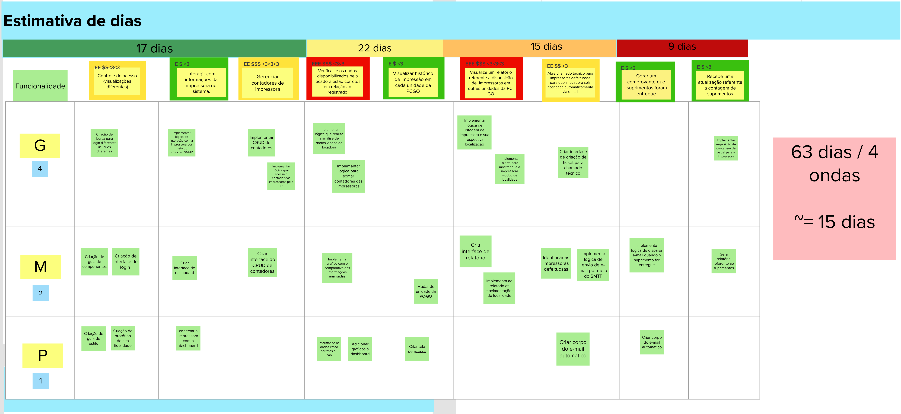

# Estimativa de dias

## 1.Introdução
   Estimar o tempo por dias de esforço é uma abordagem comum para determinar quanto tempo será necessário para completar uma tarefa, uma funcionalidade ou um projeto em geral. No nosso projeto realizamos essa estimativa seguindo os conceitos abordados no Lean Inception.

## 2. Execução

1. **Definição da Tarefa ou Funcionalidade:**
   O primeiro passo envolve a definição clara da tarefa ou funcionalidade a ser realizada. Isso requer a criação de uma descrição concisa da tarefa, bem como a definição de critérios de aceitação que ajudarão a determinar quando a tarefa estará completa.

2. **Quebrar a Tarefa em Atividades Menores:**
   Se a tarefa for complexa, é aconselhável dividi-la em atividades menores e mais gerenciáveis. Essa divisão facilita a avaliação e estimativa de cada componente, tornando o processo mais preciso.

3. **Estimativa de Dias de Esforço:**
   Neste estágio, a equipe atribui uma estimativa em dias de esforço à tarefa ou atividades menores. Essa estimativa reflete a quantidade de tempo necessária para a conclusão, sendo influenciada por fatores como complexidade, experiência prévia e recursos disponíveis.

4. **Consenso e Discussão:**
   A estimativa muitas vezes envolve várias pessoas da equipe, e é fundamental chegar a um consenso. Isso é alcançado através de discussões onde as justificativas por trás das estimativas são compartilhadas, permitindo que ajustes sejam feitos conforme necessário.

5. **Registros de Estimativas:**
   É crucial manter registros das estimativas, que podem ser registradas em uma ferramenta de gerenciamento de projetos. Nós documentamos no quadro Lean e geramos o artefato abaixo: 

   

## 3. Referências

> [1] Lean Inception - Como alinhar pessoas e construir o produto certo. Paulo Caroli.

## 4. Histórico de versão

|**Data**|**Descrição**|**Autor(es)**|
|--------|-------------|--------------|
|22/10/2023| Criação do Documento | Júlia Farias Sousa |
|22/10/2023| Revisão do Documento | Antonio Rangel |
|22/10/2023| Revisão do Documento | Guilherme Daniel Fernandes da Silva |
